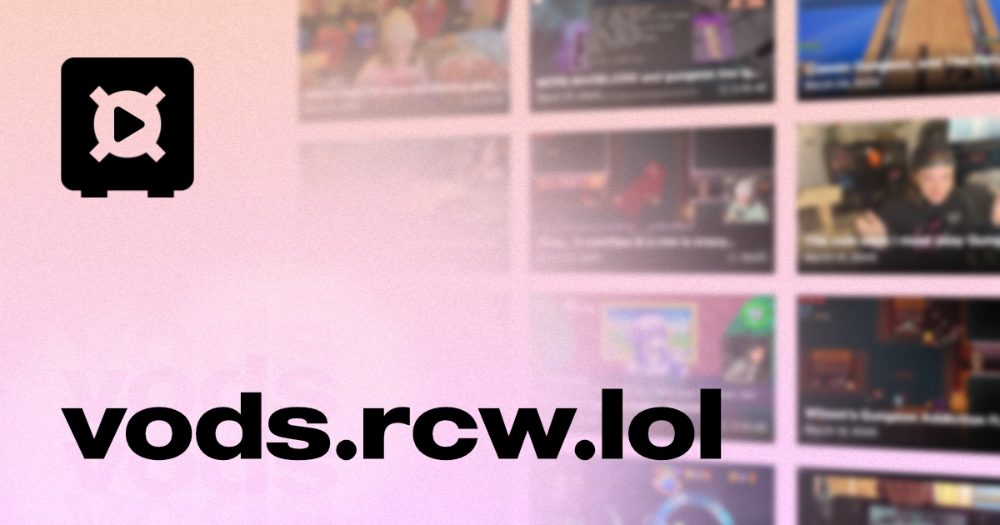

<div align="center">

# VOD Archive
A project to archive past VODs from Twitch.

</div>

## About this repo.
This is a project that uses a combination of Airtable and other automations to maintain a fully functional VOD archive for Twitch streams, or even other platforms. Complete with:

* Chat Replay
* Game Category Sorting
* Date Sorting
* Keyword Searching

And of course, this project is open source and fully available under the [MIT License](LICENSE) - modify to your hearts content.

## How does it work?
Originally derived from my own [website](https://github.com/rcwowo/website), which was in itself derived from the [astro-erudite](https://github.com/jktrn/astro-erudite) template, this project removed a lot of the unnecessary junk that was scattered around the website and made VOD archival it's own separate thing.

By using the [Airtable loader](https://github.com/ascorbic/astro-loaders) for Astro, and some automation through a self-hosted [n8n](https://n8n.io) instance, we can run a fully functional VOD archive, where new VODs that enter the "published view" will trigger [Vercel](https://vercel.com) to rebuild the website. You can see how this flow works here:


And the best part, all of this is technically free to host! A full guide will (probably) be available at some point.

## How do I modify this?
Until I make a full guide on how to create the entire system for yourself, you will have to figure out and make your own solution if you intend to fork this project. If you find a bug, please report it to me either here on GitHub, or on Discord.

That being said, if you still want to develop this for yourself, it's easy:

```sh
# Clone the repo
git clone https://github.com/rcwowo/vod-archive

# Install dependencies
cd vod-archive && bun install

# Run the test server
bun dev
```